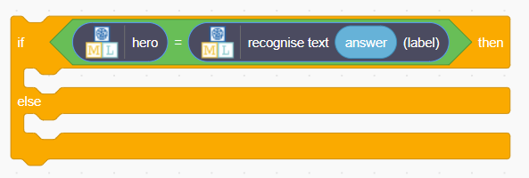
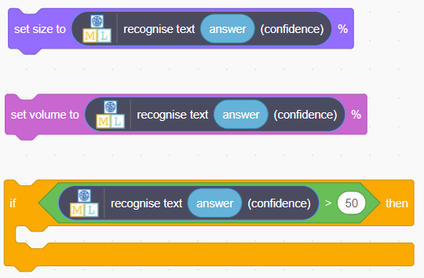

## What next?

Now it's time to upgrade your project to make it more fun or interesting!

You could:
+ Add a new costume to the sprite to replace the Scratch cat:
[[[scratch3-add-costumes-to-a-sprite]]] 

+ Add a new backdrop to your project:
[[[generic-scratch3-backdrop-from-library]]]

+ Add sounds to your project:
[[[generic-scratch3-sound-from-library]]]

+ Make your application do something depending on whether the model says 'hero' or 'villain':

--- collapse ---
---
title: Make changes based on the label
---

Use an `if/else`{:class="block3control"} block with an equals operator to check if the label for the input is 'hero'. **If** it is, do something. Otherwise, do something else. This could be `change costume to []`{:class="block3looks"} or `play sound []`{:class="block3sound"}, or anything you like!

--- /collapse ---

+ Make your application do something based on how confident it is about its prediction:

--- collapse ---
---
title: Make changes based on the confidence of the model
---

Use the `recognise text (answer) confidence` block with size and volume controls, or have something happen if the confidence is above or below a certain level:

--- /collapse ---

**This was just the warm up!** Now that you know how to build a text classification application that tells heroes from villains, what do **you** want to make? 

Join in with our [Experience AI Challenge](https://experience-ai.org/units/experience-ai-lessons/challenges/1), and make machine learning apps you care about - then submit them to us for an awesome showcase and to get professional feedback on your idea!